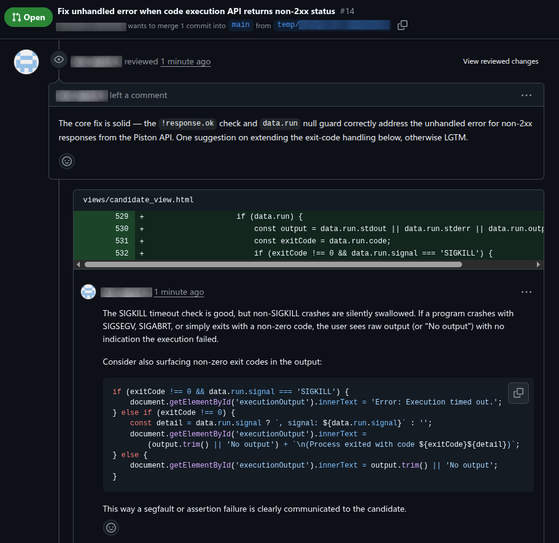
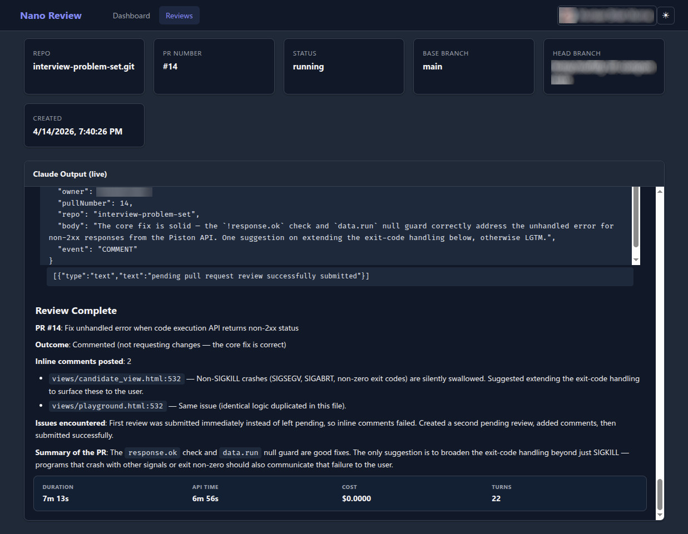

<p align="center"></p>

<p align="center">
  <h1 align="center">Nano Review</h1>
  <p align="center">
    
    
    
    
  </p>
  <p align="center">Automated AI-driven PR code review via Claude Code, running in an isolated Docker container.</p>
</p>

---

## What It Does

Nano Review is a lightweight Go microbackend that automates pull request code reviews. When a GitHub Action fires on a new or updated PR, it calls the Nano Review API, which clones the repo into an ephemeral temp directory, spawns Claude Code CLI in headless mode, and posts inline review comments directly on the pull request. Each review runs in complete isolation and cleans up after itself -- no state leaks between reviews.

## How It Works

```
 GitHub PR Event
       |
       v
 GitHub Action --(HTTP POST /review)--> API Server (Go)
                                          |
                                          v
                                     Validate payload,
                                     generate run ID
                                          |
                                     ----+----
                                     |        |
                                     v        v
                                SQLite DB   Goroutine (async)
                                (history)       |
                                                 v
                                            git clone into
                                            /tmp/<run-id>/
                                                 |
                                                 v
                                            Claude Code CLI
                                            (headless, /pr-review)
                                                 |
                                                 v
                                            GitHub MCP Server
                                            (inline comments)
                                                 |
                                                 v
                                            rm -rf /tmp/<run-id>

                                     ----+----
                                     |        |
                                     v        v
                                 GET /reviews  GET /metrics
                                 (history)     (stats)
                                        \
                                         v
                                    Web Dashboard
                                    (real-time WebSocket)
```

## Screenshots

| GitHub PR Comments | Review Dashboard |
|---|---|
|  |  |

## Quick Start

```bash
git clone https://github.com/kmmuntasir/nano-review.git
cd nano-review
cp .env.example .env   # then edit .env with your secrets
docker compose up --build
```

The server starts on `http://localhost:8080`. See [Configuration](#configuration) for required environment variables.

## Features

- Async review processing -- webhook returns immediately, review runs in a background goroutine
- Inline PR comments posted via GitHub MCP server, with summary fallback
- Ephemeral execution -- each review gets an isolated temp directory, force-deleted after completion
- Automatic retry with exponential backoff for transient failures (rate limits, network errors)
- Configurable review timeout and max agentic turns
- Real-time web dashboard with WebSocket streaming and review history
- Docker Compose overlays for dev, staging, and prod environments
- Configurable Claude model selection (Haiku, Sonnet, Opus)
- Google OAuth authentication for the dashboard
- Structured JSON logging with rotation via lumberjack

## API Endpoints

| Method | Path | Auth | Description |
|--------|------|------|-------------|
| POST | `/review` | Webhook secret | Start an async PR review. Returns `{"status": "accepted", "run_id": "<uuid>"}` |
| GET | `/reviews` | Session (if enabled) | List reviews with optional filters (`repo`, `status`, `limit`, `offset`) |
| GET | `/reviews/{run_id}` | Session (if enabled) | Get a single review record with full output |
| GET | `/metrics` | Session (if enabled) | Aggregate stats: success rate, avg duration, reviews today |
| GET | `/ws` | Session (if enabled) | WebSocket endpoint for live review streaming |
| GET | `/auth/login` | None | Redirect to Google OAuth consent screen |
| GET | `/auth/callback` | None | Handle OAuth callback, create session, redirect to dashboard |
| GET | `/auth/logout` | None | Clear session cookies, redirect to login |
| GET | `/auth/me` | None | Return current session user info as JSON |
| GET | `/` | None | Serve embedded web dashboard static files |

Full API documentation: [docs/api-documentation.md](docs/api-documentation.md)

## Configuration

Key environment variables (see [`.env.example`](.env.example) for the full list):

| Variable | Required | Default | Description |
|----------|----------|---------|-------------|
| `WEBHOOK_SECRET` | Yes | -- | Shared secret for webhook authentication |
| `ANTHROPIC_AUTH_TOKEN` | Yes | -- | Auth token for Claude Code CLI |
| `GITHUB_PAT` | Yes | -- | GitHub PAT with `repo` scope (clone + MCP) |
| `PORT` | No | `8080` | Server listen port |
| `CLAUDE_CODE_PATH` | No | auto-detected | Path to the Claude Code binary |
| `CLAUDE_MODEL` | No | `sonnet` | Claude model for reviews (`haiku`, `sonnet`, `opus`) |
| `MAX_REVIEW_DURATION` | No | `600` | Maximum review duration in seconds |
| `MAX_RETRIES` | No | `2` | Retry attempts for transient failures |
| `AUTH_ENABLED` | No | `true` | Enable Google OAuth for the dashboard |
| `DATABASE_PATH` | No | `/app/data/reviews.db` | SQLite database file path |

## Development

```bash
make dev          # Build and run (foreground)
make test         # Run tests with race detector
make test-cover   # Tests with HTML coverage report
make lint         # Vet and format code
make stage        # Build and run staging overlay
make prod         # Build and run prod overlay
make help         # Show all available targets
```

> Go tooling runs inside Docker. Use `make` targets or `docker compose run --rm nano-review go <cmd>`.

## Project Structure

```
cmd/server/main.go            # Entry point -- wire deps, start HTTP server
internal/
  api/                        # HTTP handlers, WebSocket, models
  auth/                       # Google OAuth, session management
  reviewer/                   # Clone, run Claude Code CLI, cleanup, streaming
  storage/                    # SQLite persistence, migrations, session store
config/.claude/               # Claude Code config copied into Docker image
  skills/pr-review/           # The /pr-review skill definition
  settings.json               # MCP server configuration
web/                          # Dashboard frontend (embedded via Go embed)
docs/                         # PRD, API docs, roadmap, images
tests/integration/            # Integration tests (Docker required)
```

## Documentation

| Document | Description |
|----------|-------------|
| [PRD](docs/PRD.md) | Full product requirements and architecture |
| [API Documentation](docs/api-documentation.md) | Complete endpoint reference with examples |
| [Roadmap](docs/roadmap.md) | Prioritized future features |
| [Dev Setup](docs/references/dev-setup.md) | Local development environment guide |
| [Staging Setup](docs/references/staging-setup.md) | Staging deployment guide |
| [Prod Setup](docs/references/prod-setup.md) | Production deployment guide |

## Contributing

See [CONTRIBUTING.md](CONTRIBUTING.md) for development workflow, branch naming, and commit conventions.

## License

This project is licensed under the [GNU General Public License v3.0](LICENSE).
