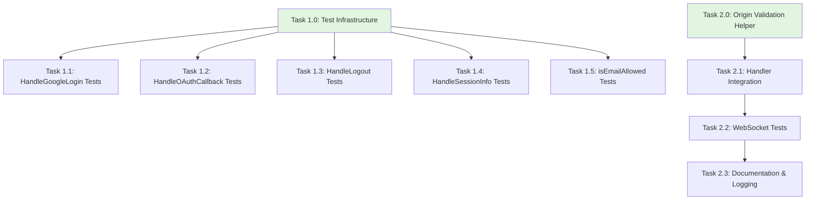

# OAuth Completion Tasks — Detailed Breakdown

> **Date**: 2026-04-13
> **Source**: Derived from [oauth-completion-tasks.md](./oauth-completion-tasks.md)
> **Purpose**: Individually actionable tasks for parallel development

---

## Parallel Execution Strategy



**Track A (OAuth Tests)**: Can be split across 5+ developers
**Track B (WebSocket Security)**: Sequential tasks best done by 1-2 developers

---

## Track A: OAuth Handler Test Coverage

### Task A0 — Test Infrastructure Setup

**Priority**: P3 (Foundation for Track A)
**Estimated Effort**: 1 hour
**Files**: `internal/auth/oauth_test.go` (new)

**Description**:
Create the test file structure and helper functions that will be used by all OAuth handler tests. This task establishes the foundation for subsequent test writing.

**Acceptance Criteria**:
- [ ] `internal/auth/oauth_test.go` created with package declaration `package auth`
- [ ] All necessary imports added (testing, net/http, net/http/httptest, strings, crypto/rand, etc.)
- [ ] `testOAuthConfig() *OAuthConfig` helper returns a test config with non-nil SessionManager
- [ ] `validStateToken() string` generates valid base64url-encoded 32-byte tokens
- [ ] `validUserInfo()` struct returns mock Google userinfo response
- [ ] Mock HTTP client type implements `http.RoundTripper`
- [ ] Mock client can control responses for token exchange and userinfo endpoints
- [ ] File compiles with `go build ./internal/auth/`

**Subtasks**:
1. Create file with package declaration and imports
2. Implement `testOAuthConfig()` helper
3. Implement `validStateToken()` helper
4. Implement `validUserInfo()` struct
5. Create `mockHTTPClient` type with configurable responses
6. Add helper to inject mock client via `OAuthConfig.HTTPClient`

**Dependencies**: None
**Blocks**: All Track A tasks (A1-A5)

---

### Task A1 — HandleGoogleLogin Tests

**Priority**: P3
**Estimated Effort**: 2 hours
**Files**: `internal/auth/oauth_test.go`
**Dependencies**: A0 (Test Infrastructure)

**Description**:
Write comprehensive unit tests for the `HandleGoogleLogin` handler, covering CSRF token generation, state cookie setting, redirect URL construction, and edge cases.

**Acceptance Criteria**:
- [ ] `TestHandleGoogleLoginSuccess` — GET generates CSRF token, sets cookie, redirects to Google
- [ ] `TestHandleGoogleLoginWithRedirectPath` — appends redirect path to state when `state` query param provided
- [ ] `TestHandleGoogleLoginSetsSecureCookieWhenHTTPS` — Secure flag true when SessionManager.Secure() true
- [ ] `TestHandleGoogleLoginSetsInsecureCookieWhenHTTP` — Secure flag false when SessionManager.Secure() false
- [ ] `TestHandleGoogleLoginReturns501WhenNotConfigured` — 501 when OAuthEndpoint nil
- [ ] `TestHandleGoogleLoginMethodNotAllowed` — POST returns 405
- [ ] `TestHandleGoogleLoginStateCookieAttributes` — HttpOnly, SameSite=Lax, MaxAge=300, Path=/
- [ ] `TestHandleGoogleLoginStateFormat` — state is `csrfToken:redirectPath` or `csrfToken:`

**Subtasks**:
1. Test successful login flow (CSRF generation, cookie, redirect)
2. Test redirect path appending to state
3. Test Secure cookie flag based on SessionManager config
4. Test all cookie attributes (HttpOnly, SameSite, MaxAge, Path)
5. Test error cases (501 not configured, 405 wrong method, 500 crypto failure)

**Dependencies**: Task A0
**Can run parallel with**: A2, A3, A4, A5 (after A0 completes)

---

### Task A2 — HandleOAuthCallback Tests

**Priority**: P3 (Critical security path)
**Estimated Effort**: 3 hours
**Files**: `internal/auth/oauth_test.go`
**Dependencies**: A0 (Test Infrastructure)

**Description**:
Write unit tests for the OAuth callback handler, covering state verification, token exchange, email domain validation, session creation, and error handling.

**Acceptance Criteria**:
- [ ] `TestHandleOAuthCallbackSuccess` — verifies state, exchanges code, creates session, redirects
- [ ] `TestHandleOAuthCallbackMissingStateParam` — returns 400 when state query param missing
- [ ] `TestHandleOAuthCallbackMissingStateCookie` — returns 400 when state cookie missing
- [ ] `TestHandleOAuthCallbackStateMismatch` — returns 400 when CSRF tokens don't match
- [ ] `TestHandleOAuthCallbackClearsStateCookie` — MaxAge=-1 on successful verification
- [ ] `TestHandleOAuthCallbackExtractsRedirectPath` — redirects to extracted path, not `/`
- [ ] `TestHandleOAuthCallbackRedirectsToRootWhenNoPath` — redirects to `/` when state is `csrfToken:`
- [ ] `TestHandleOAuthCallbackEmailDomainRejected` — returns 403 for disallowed domain
- [ ] `TestHandleOAuthCallbackInvalidEmailFormat` — returns 403 for email without `@`
- [ ] `TestHandleOAuthCallbackAllowsAnyDomainWhenListEmpty` — no restriction when AllowedEmailDomains empty
- [ ] `TestHandleOAuthCallbackMissingCodeParam` — returns 400 when code missing
- [ ] `TestHandleOAuthCallbackTokenExchangeFailure` — returns 502 on token exchange error
- [ ] `TestHandleOAuthCallbackUserinfoFetchFailure` — returns 502 on userinfo error
- [ ] `TestHandleOAuthCallbackUserinfoDecodeFailure` — returns 502 on invalid JSON

**Subtasks**:
1. Test successful callback with mock HTTP client (token exchange + userinfo)
2. Test all state verification failures (missing param, missing cookie, mismatch)
3. Test state cookie clearing after verification
4. Test redirect path extraction and fallback to `/`
5. Test email domain validation (reject, allow, empty list)
6. Test error cases (missing code, token exchange failure, userinfo failures)

**Dependencies**: Task A0
**Can run parallel with**: A1, A3, A4, A5 (after A0 completes)

---

### Task A3 — HandleLogout Tests

**Priority**: P3
**Estimated Effort**: 1 hour
**Files**: `internal/auth/oauth_test.go`
**Dependencies**: A0 (Test Infrastructure)

**Description**:
Write unit tests for the logout handler, verifying cookie clearing and redirect behavior.

**Acceptance Criteria**:
- [ ] `TestHandleLogoutClearsSessionCookie` — `nano_session` cookie has MaxAge=-1
- [ ] `TestHandleLogoutClearsSessionTokenCookie` — `nano_session_token` cookie has MaxAge=-1
- [ ] `TestHandleLogoutRedirectsToRoot` — redirects to `/`
- [ ] `TestHandleLogoutCookieAttributes` — Secure flag matches SessionManager.Secure()
- [ ] `TestHandleLogoutCookiePathsMatch` — Path matches session config

**Subtasks**:
1. Test both cookies are cleared (MaxAge=-1)
2. Test redirect to `/`
3. Test cookie attributes match session config (Secure, Path, Domain)

**Dependencies**: Task A0
**Can run parallel with**: A1, A2, A4, A5 (after A0 completes)

---

### Task A4 — HandleSessionInfo Tests

**Priority**: P3
**Estimated Effort**: 2 hours
**Files**: `internal/auth/oauth_test.go`
**Dependencies**: A0 (Test Infrastructure)

**Description**:
Write unit tests for the session info handler, covering auth-disabled detection, unauthenticated paths, and authenticated user info responses.

**Acceptance Criteria**:
- [ ] `TestHandleSessionInfoAuthDisabled` — returns `{"auth_enabled":false}` when AuthEnabled() false
- [ ] `TestHandleSessionInfoNoCredentials` — returns `{}` when no cookie/query param
- [ ] `TestHandleSessionInfoInvalidToken` — returns `{}` when token invalid
- [ ] `TestHandleSessionInfoExpiredToken` — returns `{}` when token expired
- [ ] `TestHandleSessionInfoValidTokenCookie` — returns full user info from cookie
- [ ] `TestHandleSessionInfoValidTokenQueryParam` — returns full user info from query param
- [ ] `TestHandleSessionInfoCookiePrecedence` — cookie used when both cookie and query param present
- [ ] `TestHandleSessionInfoResponseStructure` — includes id, email, name, picture fields
- [ ] `TestHandleSessionInfoContentType` — Content-Type is application/json
- [ ] `TestHandleSessionInfoMethodNotAllowed` — POST returns 405

**Subtasks**:
1. Test auth-disabled path (AuthEnabled() false)
2. Test unauthenticated paths (no credentials, invalid token, expired token)
3. Test authenticated paths (cookie, query param, precedence)
4. Test response structure (JSON fields, Content-Type)
5. Test method validation (GET only)

**Dependencies**: Task A0
**Can run parallel with**: A1, A2, A3, A5 (after A0 completes)

---

### Task A5 — isEmailAllowed Unit Tests

**Priority**: P3
**Estimated Effort**: 1 hour
**Files**: `internal/auth/oauth_test.go`
**Dependencies**: A0 (Test Infrastructure)

**Description**:
Write unit tests for the `isEmailAllowed` helper function, covering domain matching, case insensitivity, wildcard handling, and edge cases.

**Acceptance Criteria**:
- [ ] `TestIsEmailAllowedExactMatch` — returns true for exact domain match
- [ ] `TestIsEmailAllowedCaseInsensitive` — `@Example.COM` matches `example.com`
- [ ] `TestIsEmailAllowedLeadingAtSymbol` — `@domain.com` in allowed list works
- [ ] `TestIsEmailAllowedDomainNotInList` — returns false for non-matching domain
- [ ] `TestIsEmailAllowedInvalidEmailNoAt` — returns false for email without `@`
- [ ] `TestIsEmailAllowedInvalidEmailEmpty` — returns false for empty string
- [ ] `TestIsEmailAllowedEmptyListAllowsAll` — empty list returns true for valid email
- [ ] `TestIsEmailAllowedNilListAllowsAll` — nil list returns true for valid email

**Subtasks**:
1. Test allowed domain matching (exact, case-insensitive, leading @)
2. Test rejection (domain not in list, invalid email, empty email)
3. Test allow-all behavior (empty list, nil list)

**Dependencies**: Task A0
**Can run parallel with**: A1, A2, A3, A4 (after A0 completes)

---

### Task A6 — Test Coverage Verification

**Priority**: P3
**Estimated Effort**: 30 minutes
**Files**: `internal/auth/`
**Dependencies**: A1, A2, A3, A4, A5 (all tests complete)

**Description**:
Run all OAuth handler tests, verify they pass, and measure code coverage to ensure >80% for `oauth.go`.

**Acceptance Criteria**:
- [ ] All tests pass with `go test -race ./internal/auth/`
- [ ] Coverage report generated with `-coverprofile=coverage.out`
- [ ] Coverage for `oauth.go` is >80%
- [ ] No race conditions detected
- [ ] Coverage HTML report available for review

**Subtasks**:
1. Run tests with race detector: `docker compose run --rm nano-review go test -race ./internal/auth/`
2. Generate coverage report: `docker compose run --rm nano-review go test -coverprofile=coverage.out ./internal/auth/`
3. Convert to HTML: `docker compose run --rm nano-review go tool cover -html=coverage.out -o coverage.html`
4. Review coverage report and identify any gaps
5. If coverage <80%, add additional tests to cover missing paths

**Dependencies**: Tasks A1-A5 must be complete
**Blocks**: None (verification task)

---

## Track B: WebSocket CheckOrigin Security

### Task B0 — Origin Validation Helper

**Priority**: P3 (Foundation for Track B)
**Estimated Effort**: 1 hour
**Files**: `internal/api/ws_handler.go`

**Description**:
Create helper functions to validate WebSocket origins based on an allowed list. Supports exact matches and wildcard subdomain matching (e.g., `https://*.example.com`).

**Acceptance Criteria**:
- [ ] `originChecker()` function returns a CheckOrigin function
- [ ] Empty allowedOrigins list allows all origins (backward compatible)
- [ ] Exact string matching works (e.g., `https://example.com`)
- [ ] Wildcard subdomain matching works (e.g., `https://*.example.com`)
- [ ] `originMatchesWildcardDomain()` helper implements wildcard logic
- [ ] Missing Origin header allows connection (same-origin requests)
- [ ] Only HTTPS origins match HTTPS wildcard patterns
- [ ] Code compiles and is exportable for use in handlers

**Implementation**:
```go
// originChecker returns a CheckOrigin function based on allowedOrigins config.
// If allowedOrigins is empty, all origins are permitted (dev-friendly default).
// Supports exact matches and wildcard subdomains (e.g., https://*.example.com).
func originChecker(allowedOrigins []string) func(r *http.Request) bool {
    if len(allowedOrigins) == 0 {
        return func(r *http.Request) bool { return true }
    }

    return func(r *http.Request) bool {
        origin := r.Header.Get("Origin")
        if origin == "" {
            return true // Same-origin requests
        }

        for _, allowed := range allowedOrigins {
            if strings.HasPrefix(allowed, "https://*.") {
                wildcardDomain := strings.TrimPrefix(allowed, "https://*.")
                if originMatchesWildcardDomain(origin, wildcardDomain) {
                    return true
                }
            } else if origin == allowed {
                return true
            }
        }
        return false
    }
}

func originMatchesWildcardDomain(origin, wildcardDomain string) bool {
    if !strings.HasPrefix(origin, "https://") {
        return false
    }
    rest := strings.TrimPrefix(origin, "https://")
    if strings.HasSuffix(rest, "."+wildcardDomain) {
        return true
    }
    if rest == wildcardDomain {
        return true
    }
    return false
}
```

**Subtasks**:
1. Implement `originChecker()` function with empty list fallback
2. Implement exact origin matching
3. Implement wildcard subdomain matching logic
4. Handle missing Origin header (allow same-origin)
5. Ensure only HTTPS matches HTTPS wildcards

**Dependencies**: None
**Blocks**: Task B1

---

### Task B1 — Handler Integration

**Priority**: P3
**Estimated Effort**: 1 hour
**Files**: `cmd/server/main.go`, `internal/api/ws_handler.go`

**Description**:
Update the WebSocket handler to use the origin validation helper. Wire up the `WS_ALLOWED_ORIGINS` environment variable to pass allowed origins to the handler.

**Acceptance Criteria**:
- [ ] `WS_ALLOWED_ORIGINS` env var parsed in `main.go`
- [ ] Comma-separated values trimmed and split into slice
- [ ] Empty/unset env var results in empty slice (allow all origins)
- [ ] WebSocket handler accepts allowedOrigins parameter
- [ ] `originChecker()` used to set `upgrader.CheckOrigin`
- [ ] Handler registered with `RequireAuth` middleware
- [ ] Server compiles and starts successfully

**Implementation Steps**:
1. In `cmd/server/main.go`, add parsing logic:
```go
var wsAllowedOrigins []string
if origins := os.Getenv("WS_ALLOWED_ORIGINS"); origins != "" {
    for _, origin := range strings.Split(origins, ",") {
        origin = strings.TrimSpace(origin)
        if origin != "" {
            wsAllowedOrigins = append(wsAllowedOrigins, origin)
        }
    }
}
```

2. Update `internal/api/ws_handler.go`:
```go
func HandleWebSocket(hub *Hub, allowedOrigins []string) http.HandlerFunc {
    return func(w http.ResponseWriter, r *http.Request) {
        upgrader.CheckOrigin = originChecker(allowedOrigins)
        // ... existing code ...
    }
}
```

3. Update handler registration in `main.go`:
```go
mux.Handle("GET /ws", sessionMgr.RequireAuth(
    api.HandleWebSocket(hub, wsAllowedOrigins),
))
```

**Subtasks**:
1. Add env var parsing in `main.go`
2. Update `HandleWebSocket` signature to accept `allowedOrigins`
3. Use `originChecker()` to set `upgrader.CheckOrigin`
4. Update handler registration to pass `wsAllowedOrigins`

**Dependencies**: Task B0
**Blocks**: Task B2 (tests need integration)

---

### Task B2 — WebSocket Origin Tests

**Priority**: P3
**Estimated Effort**: 1.5 hours
**Files**: `internal/api/ws_handler_test.go` (new or existing)

**Description**:
Write unit tests for the origin validation logic, covering exact matches, wildcards, edge cases, and backward compatibility.

**Acceptance Criteria**:
- [ ] `TestOriginCheckerEmptyList` — empty/nil list allows all origins
- [ ] `TestOriginCheckerExactMatch` — origin in list allowed, not in list rejected
- [ ] `TestOriginCheckerWildcardSubdomain` — `https://foo.example.com` matches `https://*.example.com`
- [ ] `TestOriginCheckerWildcardNested` — `https://bar.baz.example.com` matches `https://*.example.com`
- [ ] `TestOriginCheckerWildcardExactMatch` — `https://example.com` matches `https://*.example.com`
- [ ] `TestOriginCheckerWildcardProtocolMismatch` — `http://` does NOT match `https://*.`
- [ ] `TestOriginCheckerMissingOriginHeader` — no Origin header allowed (same-origin)
- [ ] `TestOriginCheckerMultipleOrigins` — comma-separated list all work
- [ ] `TestOriginCheckerMixedPatterns` — exact and wildcard patterns work together
- [ ] All tests pass with `go test -race ./internal/api/`

**Subtasks**:
1. Test empty list behavior (allow all)
2. Test exact origin matching
3. Test wildcard subdomain matching (including nested subdomains)
4. Test protocol matching (HTTPS only)
5. Test missing Origin header handling
6. Test multiple origins and mixed patterns

**Dependencies**: Task B1
**Blocks**: Task B3 (documentation should reflect tested behavior)

---

### Task B3 — Documentation & Production Logging

**Priority**: P3
**Estimated Effort**: 1 hour
**Files**: `.env.example`, `docker-compose.prod.yml`, `cmd/server/main.go`

**Description**:
Add documentation for the `WS_ALLOWED_ORIGINS` environment variable and implement a warning log when unset in production-like environments.

**Acceptance Criteria**:
- [ ] `.env.example` documents `WS_ALLOWED_ORIGINS` with examples
- [ ] `docker-compose.prod.yml` documents the variable
- [ ] Warning logged when env var unset in production-like environment
- [ ] Heuristic: warn if `PORT=8080` and `SECURE_COOKIES != "false"`
- [ ] Documentation includes wildcard syntax examples
- [ ] Documentation explains backward compatibility (empty = allow all)

**Implementation**:
1. Add to `.env.example`:
```bash
# WebSocket origin restrictions (comma-separated)
# Empty or unset allows all origins (dev-friendly default).
# Supports exact matches (https://example.com) and wildcard subdomains (https://*.example.com)
# WS_ALLOWED_ORIGINS=https://yourdomain.com,https://*.yourdomain.com
```

2. Add to `docker-compose.prod.yml`:
```yaml
# Optional Variables (WebSocket Security):
#   WS_ALLOWED_ORIGINS           Comma-separated list of allowed WebSocket origins.
#                               Empty or unset allows all origins (NOT recommended for production).
#                               Supports wildcards: https://*.example.com
```

3. Add warning in `main.go`:
```go
if len(wsAllowedOrigins) == 0 {
    if os.Getenv("PORT") == "8080" && os.Getenv("SECURE_COOKIES") != "false" {
        slog.Warn("WS_ALLOWED_ORIGINS not set, WebSocket connections will accept any origin",
            "recommendation", "set WS_ALLOWED_ORIGINS=https://yourdomain.com in production")
    }
}
```

**Subtasks**:
1. Document env var in `.env.example`
2. Document env var in `docker-compose.prod.yml`
3. Add production-aware warning log in `main.go`
4. Verify documentation is clear and includes examples

**Dependencies**: Task B1
**Blocks**: None

---

## Cross-Track Summary

### Developer Allocation Matrix

| Developer | Tasks | Effort | Notes |
|-----------|-------|--------|-------|
| Dev 1 | A0 → A1 | 3h | Test infrastructure + HandleGoogleLogin |
| Dev 2 | A0 → A2 | 4h | Test infrastructure + HandleOAuthCallback (largest task) |
| Dev 3 | A0 → A3 | 2h | Test infrastructure + HandleLogout |
| Dev 4 | A0 → A4 | 3h | Test infrastructure + HandleSessionInfo |
| Dev 5 | A0 → A5 | 2h | Test infrastructure + isEmailAllowed |
| Dev 6 | B0 → B1 → B2 → B3 | 4.5h | Full WebSocket security track |
| Dev 7 | A6 (verification) | 0.5h | Coverage verification after all tests complete |

### Task Dependencies (Critical Path)

```
Track A Critical Path:
A0 (1h) → [A1,A2,A3,A4,A5 parallel] → A6 (0.5h)
Total: 5h with 5 developers (after A0)

Track B Critical Path:
B0 (1h) → B1 (1h) → B2 (1.5h) → B3 (1h)
Total: 4.5h with 1 developer
```

### File Touch Matrix

| File | Tasks | Type |
|------|-------|------|
| `internal/auth/oauth_test.go` | A0-A6 | New |
| `internal/api/ws_handler.go` | B0, B1 | Modify |
| `internal/api/ws_handler_test.go` | B2 | New/Modify |
| `cmd/server/main.go` | B1, B3 | Modify |
| `.env.example` | B3 | Modify |
| `docker-compose.prod.yml` | B3 | Modify |

### Risk Mitigation

- **A0 is a hard dependency** for all Track A tasks — complete this first
- **B0-B1 are sequential** — assign Track B to a single developer
- **Track A and B are independent** — can run fully in parallel
- **A6 should wait** until all A1-A5 tests are complete

---

## Success Criteria

### Track A Success
- [ ] All OAuth handlers have dedicated unit tests
- [ ] CSRF state verification tested end-to-end
- [ ] Email domain validation edge cases covered
- [ ] Auth-disabled detection tested
- [ ] Test coverage for `oauth.go` >80%
- [ ] All tests pass with race detector

### Track B Success
- [ ] `WS_ALLOWED_ORIGINS` env var controls origin policy
- [ ] Wildcard subdomain matching works correctly
- [ ] Tests verify origin validation logic
- [ ] Documentation updated (`.env.example`, `docker-compose.prod.yml`)
- [ ] Production warning logged when unset
- [ ] Backward compatible (empty = allow all)

---

## Completion Checklist

Before marking these tasks complete:

- [ ] All tests pass: `docker compose run --rm nano-review go test -race ./...`
- [ ] No race conditions detected
- [ ] Coverage report shows >80% for `oauth.go`
- [ ] WebSocket origin tests pass with various patterns
- [ ] Production warning appears in logs when appropriate
- [ ] Documentation is clear and includes examples
- [ ] Server compiles and starts without errors
- [ ] Backward compatibility verified (empty lists maintain current behavior)

---

## Notes

### Testing OAuth Callbacks
OAuth handlers involve external HTTP calls. For unit tests:
1. Use `OAuthConfig.HTTPClient` field to inject a mock client
2. Mock responses for `POST https://oauth2.googleapis.com/token` and `GET https://www.googleapis.com/oauth2/v2/userinfo`
3. Do NOT make real HTTP calls in unit tests
4. Consider integration tests for full OAuth flow with test credentials

### WebSocket Origin Security
- `CheckOrigin` is called before WebSocket upgrade
- Return `true` to allow, `false` to reject with 403
- Current behavior: all origins allowed (dev-friendly)
- After change: all origins allowed when `WS_ALLOWED_ORIGINS` empty (backward compatible)
- Production recommendation: `WS_ALLOWED_ORIGINS=https://yourdomain.com`

### Why Low Priority?
1. **OAuth Tests**: Critical security logic already tested indirectly via integration tests
2. **WebSocket CheckOrigin**: Protected by `RequireAuth` middleware — permissive origin is low risk without valid tokens
